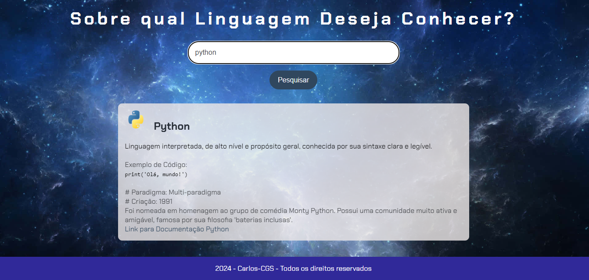

# Projeto - Assistente de Busca - Imersão Alura X Google

Este é um projeto simples de aplicação web que permite realizar buscas a partir de um campo de input. A funcionalidade de busca pode ser acionada tanto pelo clique no botão "Pesquisar" quanto pressionando a tecla "Enter".

## Funcionalidades

- Campo de input para digitar a pesquisa.
- Botão de "Pesquisar" para acionar a busca.
- Acionamento da busca pressionando a tecla "Enter".
- Integração com APIs ou serviços de busca (em construção).

## Tecnologias Utilizadas

- **HTML**: Estrutura básica da aplicação.
- **CSS**: Estilos simples para a interface do usuário.
- **JavaScript**: Lógica para captura de eventos e acionamento da função de busca.

## Estrutura de Arquivos

```bash
├── index.html       # Página principal
├── style.css        # Estilos da aplicação
└── app.js           # Lógica JavaScript
```


## Agradecimentos
Este projeto foi desenvolvido graças à imersão oferecida pela Alura e Google, onde aprendi conceitos importantes de desenvolvimento web e pude avançar significativamente na minha jornada como desenvolvedor. Agradeço a essas plataformas por fornecerem um ambiente de aprendizado tão rico e acessível, ajudando a transformar ideias em realidade.

## Contribuições
Contribuições são bem-vindas! Sinta-se à vontade para abrir uma issue ou enviar um pull request com sugestões e melhorias.