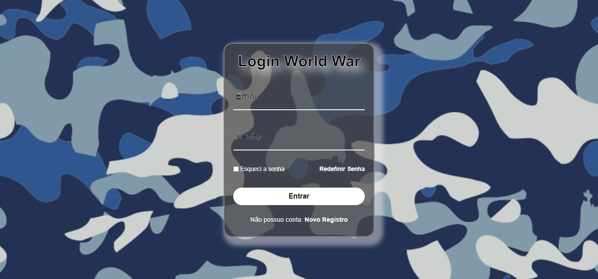
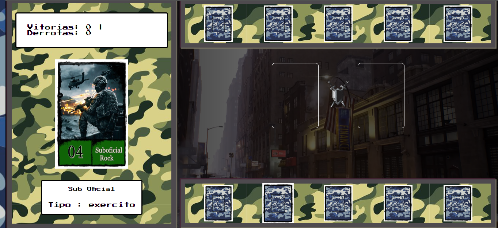

# Projeto World War, baseado em Yugioh jokenpô

## Projeto de um Jogo de Cartas Yugiho Jokempô com alterações, se tornando um Jogo de Cartas de Guerra.

### DESCRIÇÃO:
Vamos recriar um jogo do Yu-Gi-Oh utilizando as mecânicas de jogo do Jo-Ken-Po, vamos explorar conceitos avançados de organização de states com Javascript puro, estruturação de arquivos e criação de funções reaproveitáveis.
### Tecnologias Utilizadas:
 - HTML
 - CSS
 - JavaScript

### Front-End - Avançado
- Foram feitas adaptações com novos cards, tela de login totalmente desenvolvida fora deste bootcamp, novos background dos cards, paleta de cores e backgrond do game, audio do jogo, favicons e lógica de qual a carta que vence qual. 
- Todo o código foi digitado letra a letra por mim, acompanhando as orientações das aulas e após finalizar as aulas, fiz minhas adaptações e personalizações no Jogo.

