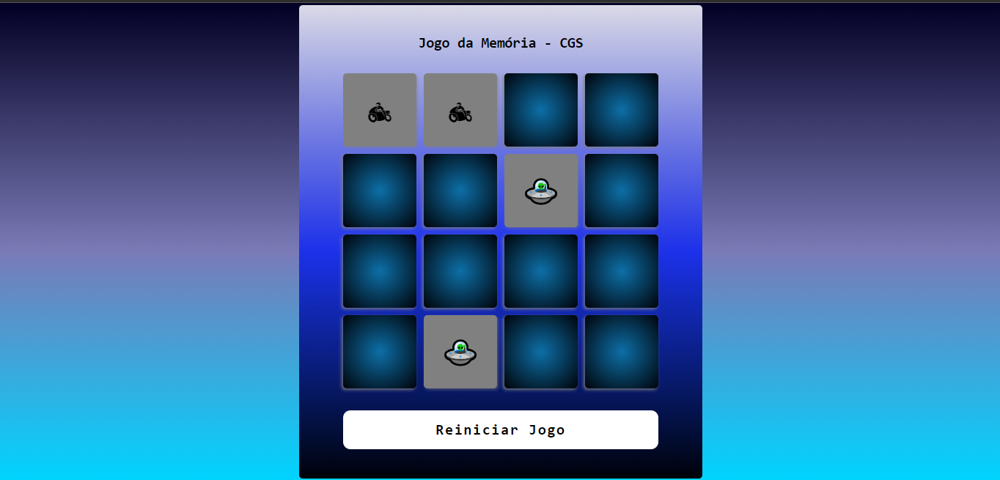
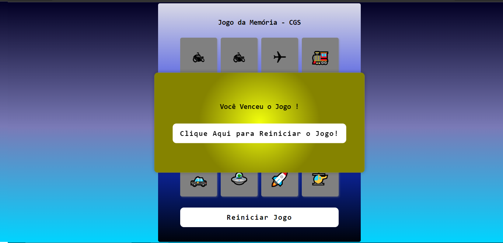

# Projeto de um Jogo da Memória Personalizado - DIO

## Projeto de um Jogo da Memória com Adaptações, Alterações e Personalização para torna-lo individual.

### DESCRIÇÃO:
Vamos utilizar HTML, CSS e Javascript para criar um jogo baseado no filme Detona Ralph, aonde o objetivo é acertar o Ralph na janela que ele aparecer, ao longo do projeto vamos explorar eventos Javascript e manipular áudios no browser.

### Tecnologias Utilizadas:
 - HTML
 - CSS
 - JavaScript

### Front-End - Intermediário
- Foi adaptado por mim novo layout, paleta de cores, sons e div de vncedor quando finaliza o jogo.
- Todo o código foi digitado letra a letra por mim, acompanhando as orientações das aulas e após finalizar as aulas, fiz minhas adaptações e personalizações no Jogo.

