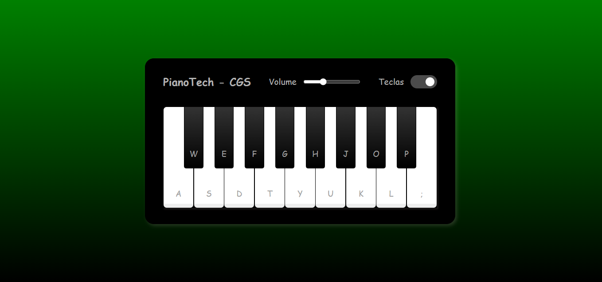

# Projeto de Piano desenvolvido em um Bootcamp da DIO
## Projeto de Piano Interativo com Mouse e Teclado, com pequenas Alterações e Personalização.
- DESCRIÇÃO:
Que tal construir um simulador de piano totalmente funcional no seu navegador ? aproveite para aprender mais sobre HTML, CSS e o poder de manipulação da D.O.M. do Browser através de Javascript e como interagir com áudios.

- Tecnologias Utilizadas:
HTML
CSS
JavaScript

 - Front-End - Intermediário
  
Foi adaptado por mim novas cores de background e sombas nos elementos.
Todo o código foi digitado letra a letra por mim, acompanhando as orientações das aulas e após finalizar as aulas, fiz minhas adaptações e personalizações no Jogo.

